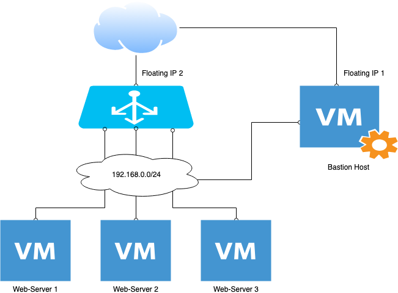

## Описание

Стенд запускает:
* Лоад балансер c внешним IP, тип HTTP, внешний порт 80
* Бастион хост с внешним IP
* 3 ноды  без внешнего адреса, ставит на них nginx и дефолтной страницей hostname
* Сервера с nginx, LB и Bastion-host находятся в локальной сети 192.168.0.0./24

при запросак к LB через RR отдается информация с каждой ноды (т.е. будут отдаваться hostnam'ы по кругу).



## Пример

Скопировать в корне secret.tfvars.example в secret.tfvars, пример заполнение, информация про квоты и регион есть в [этом readme](../README.md)

Перейти в lb-3-servers-jumpbox
```bash
cd lb-3-servers-jumpbox
```

Запуск стенда
```bash
$ terraform apply  -var-file="../secret.tfvars"
...
Apply complete! Resources: 25 added, 0 changed, 0 destroyed.

Outputs:

LB_floatingip_address = 185.91.52.220
server_floatingip_address = 185.91.52.140

```

Проверка, имена хостов отдатся по очереди
```bash
$ curl $(terraform output LB_floatingip_address)
web-2

$ curl $(terraform output LB_floatingip_address)
web-1

$ curl $(terraform output LB_floatingip_address)
web-2

$ curl $(terraform output LB_floatingip_address)
web-1
```

Добавление ноды в кластер
```bash
TF_VAR_server_count=3 terraform apply  -var-file="../secret.tfvars"
...
openstack_compute_instance_v2.web_servers[2]: Creation complete after 44s [id=d07dbbb7-2074-4d14-b71a-0380dbe035c1]

Apply complete! Resources: 4 added, 0 changed, 0 destroyed.

Outputs:

LB_floatingip_address = 185.91.52.220
server_floatingip_address = 185.91.52.140
```

Проверка, появился третий хост
```bash
$ curl $(terraform output LB_floatingip_address)
web-2

$ curl $(terraform output LB_floatingip_address)
web-1

$ curl $(terraform output LB_floatingip_address)
web-3

$ curl $(terraform output LB_floatingip_address)
web-2

$ curl $(terraform output LB_floatingip_address)
web-1

$ curl $(terraform output LB_floatingip_address)
web-3
```

Удаление стенда
```bash
terraform destroy  -var-file="../secret.tfvars"
```
