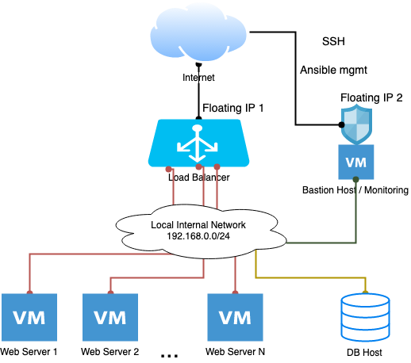
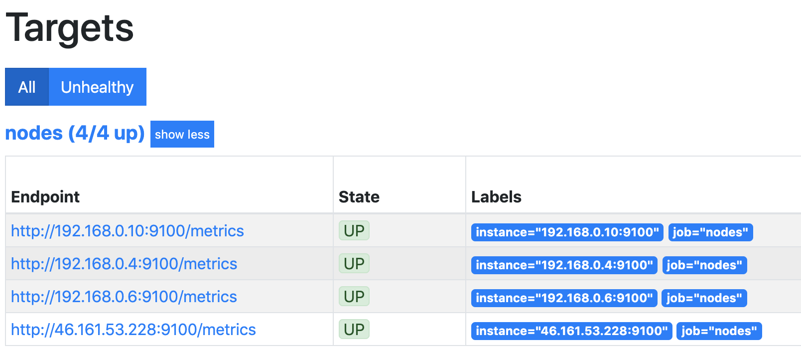
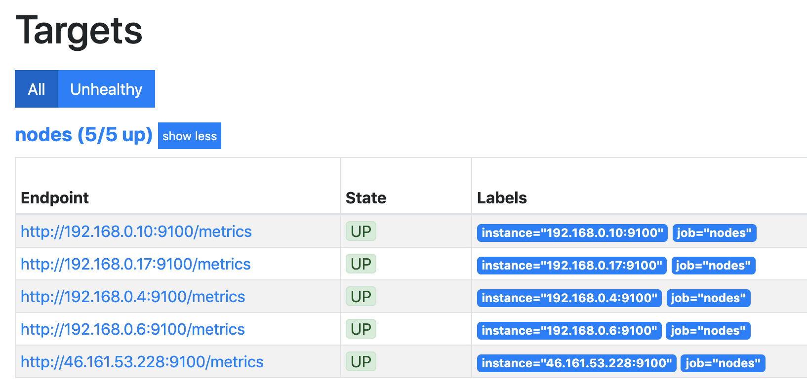

## Описание

Лаба состоит из трех этапов:
1. Создание ВМ, сетей, ЛБ через терраформ.
2. Формирование inventory для ansible из output переменных terraform.
3. Провижининг нод через Ansible-плейбуки.

Стенд запускает:
* Лоад балансер c внешним IP, тип HTTP, внешний порт 80
* Бастион хост с внешним IP
* 2 ноды  без внешнего адреса, ставит на них nginx, index-страница возращает hostname ноды
* Сервер БД, в данном примере как таковой не используется.
* Сервера с nginx, LB и Bastion-host находятся в локальной сети 192.168.0.0./24

Дополнительно:
* Увеличение количествао web-нод через терраформ
* Повторный прогон ansible - в мониторинге должна отобратиться новая нода

при запросак к LB через RR отдается информация с каждой ноды (т.е. будут отдаваться hostnam'ы по кругу).



## Демонстрация Лабы

### Подготовка
Скопировать в корне secret.tfvars.example в secret.tfvars, пример заполнение, информация про квоты и регион есть в [этом readme](../README.md)

### Разворачивание стенда

Перейти в llb-jumbox-3-nodes-db
```bash
cd lb-jumbox-3-nodes-db
```
Запуск стенда
```bash
$ terraform apply  -var-file="../secret.tfvars"
...
Apply complete! Resources: 28 added, 0 changed, 0 destroyed.

Outputs:

LB_floatingip_address = 46.161.53.208
ansible_inventory = # All hosts
[jumpbox-group]
jumpbox ansible_host=46.161.53.228

[www]
web-1 ansible_host=192.168.0.10 ansible_ssh_common_args='-o ProxyCommand="ssh -W %h:%p -q root@46.161.53.228"'
web-2 ansible_host=192.168.0.4 ansible_ssh_common_args='-o ProxyCommand="ssh -W %h:%p -q root@46.161.53.228"'


[db-group]
db ansible_host=192.168.0.6 ansible_ssh_common_args='-o ProxyCommand="ssh -W %h:%p -q root@46.161.53.228"'


server_floatingip_address = 46.161.53.228
```

В output переменной ansible_inventory terrafom сформировал инвентори-файл для ansible.

### Получание инвентори для ansible

Перейти в каталог ansible
```bash
cd ansible
```

Сформированить инвентори-файл (два способа):
```bash
terraform output -state=../terraform.tfstate   ansible_inventory > inventory.ini
или
./get_inventory.sh
```

### Сетап стенда через ansible
Выполняется из каталога ansible

Запуск плейбака, на jumpbox установит prometheus, на веб-хосты установит nginx, на все хосты установит node exporter.
```bash
ansible-playbook -i inventory.ini playbooks/setup.yaml

...
PLAY RECAP ******************************************************************************************
db                         : ok=3    changed=3    unreachable=0    failed=0
jumpbox                    : ok=5    changed=5    unreachable=0    failed=0
web-1                      : ok=7    changed=6    unreachable=0    failed=0
web-2                      : ok=7    changed=6    unreachable=0    failed=0
```

### Проверка

Проверка, имена хостов отдатся по очереди
```bash
# Перейти в каталог с терраформом
cd ../
```
Обратимся к LB, он будет отдавать трафик с двух веб-серверов
```bash
$ curl $(terraform output LB_floatingip_address)
web-1

$ curl $(terraform output LB_floatingip_address)
web-2

$ curl $(terraform output LB_floatingip_address)
web-1

$ curl $(terraform output LB_floatingip_address)
web-2
```

Можно проверить прометеус, открыв в браузере адрес jumpbox'a на порту 9090
```bash
echo "http://$(terraform output server_floatingip_address):9090/targets"
```

В списке nodes будет 4 источника.



### Добавление ноды в кластер

Добавление ноды в кластер, используя env переменную
```bash
TF_VAR_server_count=3 terraform apply  -var-file="../secret.tfvars"
...
Apply complete! Resources: 4 added, 0 changed, 0 destroyed.
```

### Сетап новой ноды
```bash
cd ansible
./get_inventory.sh
ansible-playbook -i inventory.ini playbooks/setup.yaml
...
PLAY RECAP ******************************************************************************************
db                         : ok=3    changed=1    unreachable=0    failed=0
jumpbox                    : ok=5    changed=3    unreachable=0    failed=0
web-1                      : ok=7    changed=1    unreachable=0    failed=0
web-2                      : ok=7    changed=1    unreachable=0    failed=0
web-3                      : ok=7    changed=6    unreachable=0    failed=0

cd ../
```

### Проверка

Проверка, появился третий хост
```bash
$ curl $(terraform output LB_floatingip_address)
web-1

$ curl $(terraform output LB_floatingip_address)
web-2

$ curl $(terraform output LB_floatingip_address)
web-3

$ curl $(terraform output LB_floatingip_address)
web-1

$ curl $(terraform output LB_floatingip_address)
web-2

$ curl $(terraform output LB_floatingip_address)
web-3
```

Проверить Prometheus
```bash
echo "http://$(terraform output server_floatingip_address):9090/targets"
```

Появится пятая нода



### Удаление стенда
Удаление стенда
```bash
terraform destroy  -var-file="../secret.tfvars"
```
